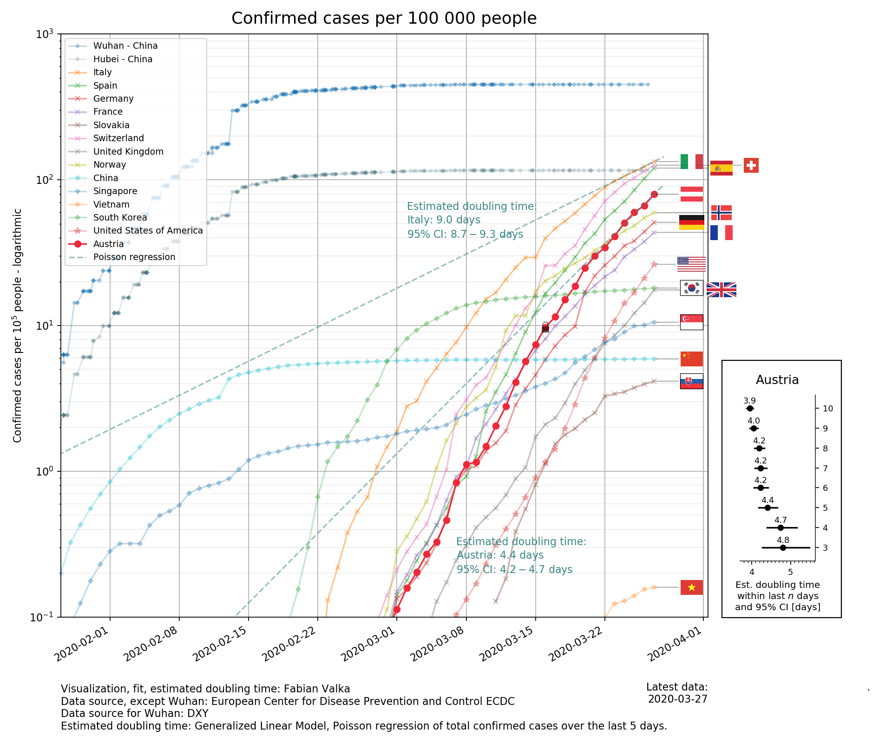

# Visualization of COVID-19 Confirmed Cases for Austria

This Jupyter notebook produces a log-scaled plot of confirmed cases per 10^5 people for different countries,
with a focus on Austria.

## Warning! Read this

* I'm not an expert in medicine, epidemiology, biology or similar
* This style has been mostly developed for me and my friends, mostly people with graduate level degrees in science or technology and might not at all be suitable for the general public!
* The code may contain bugs, is not well verified or tested 
* The assumptions about the fit might be completely wrong
* Use at your own risk and consider the implications of publishing the visualization and whom you publish it to

### Visualize Responsibly 
Please read those excellent articles on the Tableau blog:

* [10 considerations before you create another chart about COVID-19](https://www.tableau.com/about/blog/2020/3/ten-considerations-you-create-another-chart-about-covid-19)

* [What the BBC got wrong in their Covid-19 visualization] https://www.tableau.com/about/blog/2020/3/covid-19-resources-data-viz-best-practices

## Do this if you use it!
* Update your visualization regularly 
* Verify each output by hand with primary sources for your country
* Look for mistakes and open an issue or pull request

## Example Output


## Data Sources
### ECDC Data
Primarily data from the European Center for Disease Prevention and Control is used. Actually all lines, except for "Wuhan - China" are plotted based upon this dataset. 

[ECDC COVID-19 Public Dataset](https://www.ecdc.europa.eu/en/publications-data/download-todays-data-geographic-distribution-covid-19-cases-worldwide)

## Doubling Time Estimation
The doubling time and its confidence interval are estimated using a generalized linear model
fitting of a [Poisson regression (log-normal)](https://en.wikipedia.org/wiki/Poisson_regression)
model to the cumulative cases using maximum likelihood estimation. 

[Satsmodels GLM module](https://www.statsmodels.org/stable/glm.html) 
is used as the software implementation.

Our log-linear model for the cumulative case count y at day x is:


Using this module the fitted function form is:

%20%3D%20e%5E%7B%5Cbeta_0%20%2B%20%5Cbeta%20x%7D)

This is formulated in patsy as

```
y ~ x
```

Doubling time estimates, as well as the confidence intervals in doubling time estimates are obtained by calculating the doubling time from the exponential functions slope parameter. 


## Installation

* Install python >= 3.6 and Jupyter notebook

* Install required python packages

```
pip install -r requirements.txt
```

* Download the data repositories using git clone, as described in the data/README.md file. 